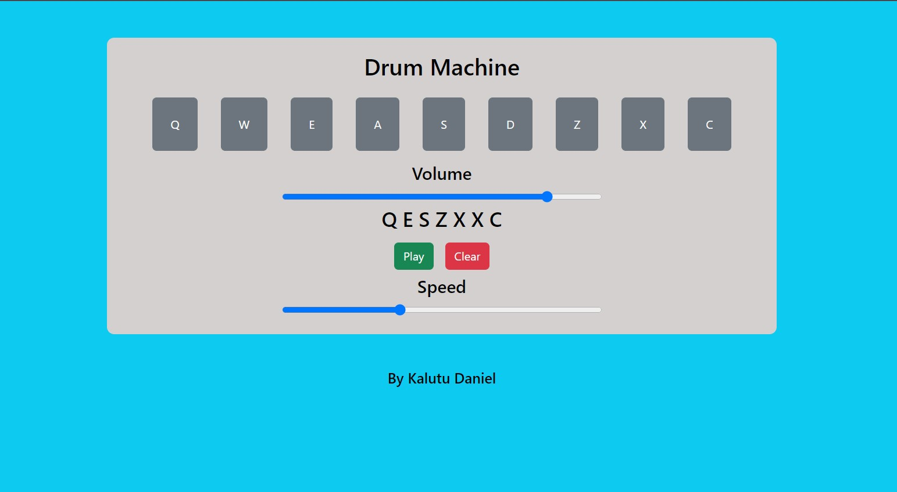

# Drum Machine
This is a drum machine application built using React. It allows users to play different audio clips by clicking on buttons or using keyboard keys. The application also provides options to adjust the volume and record/playback custom sequences.

## Preview


## Installation
1. Clone the repository or download the source code.
2. Navigate to the project directory.
3. Run the following command to install the required dependencies:
```npm install```
4. After the installation is complete, start the application by running:
```npm start```
5. The drum machine will be accessible at `http://localhost:3000` in your web browser.

## Usage
- Each button represents a different drum sound.
- Clicking on a button or pressing the corresponding key triggers the associated audio clip.
- The volume slider allows adjusting the volume of the audio clips.
- The "Record" button enables recording a sequence of played clips.
- The "Play" button plays back the recorded sequence.
- The "Clear" button clears the recorded sequence.
- The speed slider adjusts the playback speed of the recorded sequence.

## Components
The application consists of the following React components:
- `App`: The main component that contains the drum machine interface and manages the state for volume, recording, and playback speed.
- `Pad`: Represents an individual drum pad/button. It handles the playback of audio clips and manages the recording functionality.

## Dependencies
The application utilizes the following dependencies:
- React: A JavaScript library for building user interfaces.
- ReactDOM: A package that provides DOM-specific methods for React.

## Contributing
Contributions to the drum machine application are welcome! If you find any issues or have suggestions for improvements, please open an issue or submit a pull request.

## Credits
This Drum Machine project is part of the [FreeCodeCamp Frontend Certification](https://www.freecodecamp.org/learn/front-end-libraries/) course. It was completed as one of the required projects in the curriculum.

FreeCodeCamp (FCC) is a nonprofit organization that offers a comprehensive web development curriculum and certifications. The Frontend Certification focuses on frontend libraries and frameworks like React, and it covers various topics including HTML, CSS, JavaScript, and more.

Learn more about FreeCodeCamp and their educational programs on their official website: [https://www.freecodecamp.org/](https://www.freecodecamp.org/)


